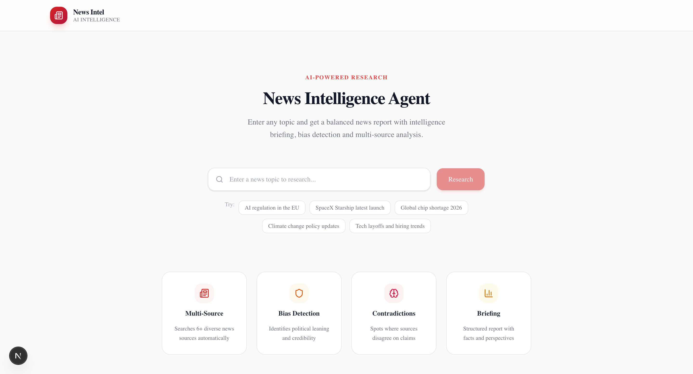
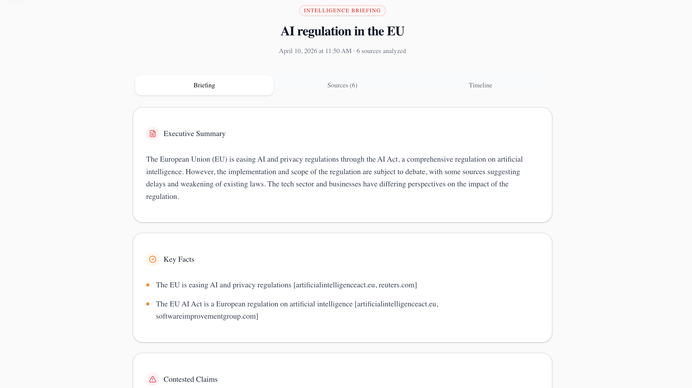

# News Intelligence Agent

An AI-powered news research tool that takes any topic and delivers a structured intelligence briefing — with bias detection, source credibility scoring, and contradiction analysis — in seconds.

## What it does

Enter a topic (e.g. *"AI regulation 2025"* or *"Gaza ceasefire"*) and the agent:

1. **Searches** — queries Tavily across 6+ diverse news sources
2. **Analyzes** — uses Groq (Llama 3.1 8B) to score each source for political bias and credibility, and surfaces key claims
3. **Generates** — produces a structured briefing with an executive summary, key facts, contested claims, multiple perspectives, and a timeline

### Briefing output

The final report includes:
- **Executive Summary** — concise overview of the topic
- **Key Facts** — verified, cross-source facts
- **Contested Claims** — where sources disagree
- **Perspectives** — left / center / right viewpoints
- **Timeline** — chronological event breakdown
- **Source Cards** — per-source bias label, credibility score, and summary

## Tech stack

| Layer | Tool |
|---|---|
| Framework | Next.js (App Router) |
| UI | Tailwind CSS + shadcn/ui |
| Search | [Tavily](https://tavily.com) |
| LLM | [Groq](https://groq.com) — `llama-3.1-8b-instant` |
| Streaming | Server-Sent Events (SSE) |

## Getting started

### Prerequisites

- A [Tavily API key](https://tavily.com) (free tier available)
- A [Groq API key](https://console.groq.com) (free tier available)

## License

MIT
